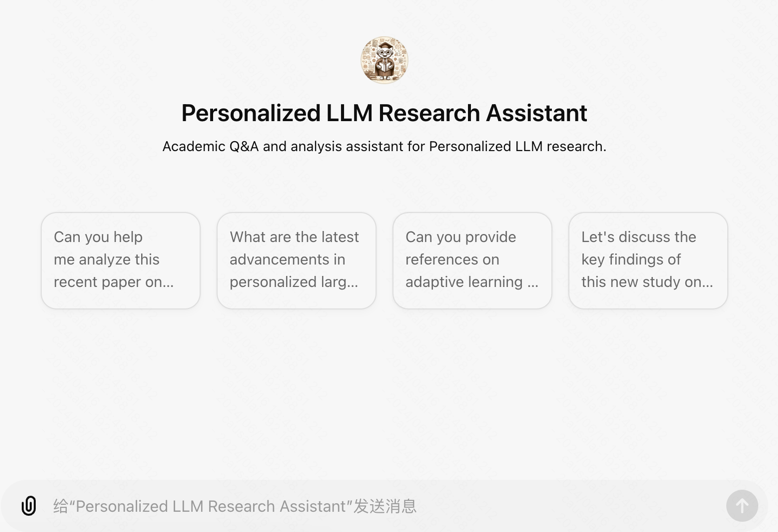
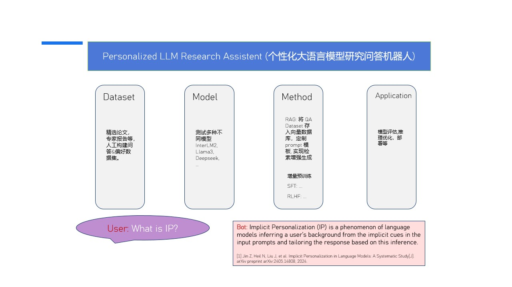

# Personalized LLM Research Assistent (个性化大语言模型领域研究助理)

随着大语言模型(LLMs)
在自然语言处理领域取得显著进展,其在人机交互方面展现出巨大潜力。然而,当前LLMs主要对齐整体人类偏好,难以充分满足用户的个性化需求。
鉴于人类价值观和偏好的多样性,以及语用在人际交互中的重要性,我们认为LLMs的发展需要从对齐群体偏好转向个性化。个性化大语言模型(
Personalized LLM)被认为是LLMs发展历程中的下一个重要步骤,但目前尚未在大规模应用中得到充分实现[1]
。作为一个前沿研究领域,学者们迫切需要一个可靠的工具来回答与该领域相关的专业问题。
我们的目标是开发一个定制化的问答机器人,专注于为学者提供个性化大语言模型领域的专业知识和有价值的参考资料。
该机器人将具备以下特点:

1. 专业性:深入了解个性化大语言模型领域的最新进展,提供权威、可靠的信息。
2. 交互性:通过自然语言交互,营造友好、高效的问答体验,鼓励学者深入探讨。
3. 可扩展性:随着研究的深入,不断更新知识库,确保信息与时俱进。

我们相信,这样一个专注于个性化大语言模型领域的定制化问答机器人,将为学者们提供强有力的支持,促进该领域的研究和创新。

[1] Personalisation within bounds: A risk taxonomy and policy framework for the alignment of large language models
with personalised feedback HR Kirk, B Vidgen, P Röttger, SA Hale - arXiv preprint arXiv:2303.05453, 2023

## NEWs

- [2024.06.16] Counterfactual 发布 Personalized LLM Research Assistent V0.1.
- [2024.06.10] Personalized LLM Research
  Assistent [GPT Agent](https://chatgpt.com/share/30ba0ff4-2986-4d40-9db6-0a97b10a0b82) & [茴香豆创建的助手](https://openxlab.org.cn/apps/detail/tpoisonooo/huixiangdou-web)
  测试发现效果一般.
  

## 技术路线

具体来说,我们将采用以下技术框架:

如上图所示,我们的系统由以下几个模块组成:

- Dataset: 个性化大语言模型领域的专业知识和有价值的参考资料。
- Model: 个性化大语言模型,用于回答用户提出的问题, 包括 InternLM2, Llamm3, DeepseekV2等。
- Method: 探索多种方法, 包括 RAG, 增量预训练, SFT, 偏好学习等, 帮助模型获得领域专业知识, 成为个性化大模型领域研究助理.
- Application: 模型评估, 推理优化, 模型部署等.

### 1. Dataset

我们的数据集是从个性化大语言模型领域的专业知识和有价值的参考资料中提取的, 通过专业人员的筛选, 整理, 生成的。

- [论文资料收集](https://swze06osuex.feishu.cn/docx/VvfbdgciDohaNDxKnj0ccTBTnad?from=from_copylink)
- ....

### 2. Model

我们将采用多种大语言模型, 包括 InternLM2, Llamm3, DeepseekV2等, 用于回答用户提出的问题。

### 3. Method

我们将探索多种方法, 包括 RAG, 增量预训练, SFT, 偏好学习等, 帮助模型获得领域专业知识, 成为个性化大模型领域研究助理.

### 4. Application

我们将对模型进行评估, 推理优化, 模型部署等, 以提供更好的服务.

## 开发计划

想要开发出来对于领域知识有深入理解的研究助理, 不会是什么容易的事情. 我们要考虑很多维度, 包括数据集的质量, 模型的性能,
方法的有效性, 应用的实用性等等. 我们的开发计划如下:

- [x] 数据集的构建(论文等)
- [x] 模型的选择(InternLM2, Llamm3, DeepseekV2等)
- [x] 方法的探索(RAG, 增量预训练, SFT, 偏好学习等)
- [x] 应用的开发

## 常见问题 QA

Q1. 为什么要开发这个机器人? 这个研究助手是为每个学者提供个性化的大语言模型服务吗？

A1. 个性化大语言模型领域是一个前沿研究领域,学者们迫切需要一个可靠的工具来回答与该领域相关的专业问题。更加具体的来说,
是我们正在进行一个个性化大语言模型的研究项目, 所以需要一个该领域的研究助理, 帮助整理文献, 写作论文, 启发思考等.
请注意这个研究助手是专注于“个性化大语言模型”领域的专业 Agent，帮助学者在这一领域进行科研工作，而不是为每位学者提供个性化服务。

Q2. 直接使用茴香豆或者其他做 RAG 不就够了吗? 为什么还在考虑微调?

A2. RAG和模型微调各有优劣。对于需要广泛知识和实时更新的场景,RAG可能更为适用;而对于需要深入、专业知识和一致性的场景,模型微调可能是更好的选择。RAG
技术很好, 但是模型没有深入理解个性化大语言模型领域的专业知识和有价值的参考资料, 所以需要微调. 当下最强大的 RAG 技术(
我们制作的 GPT Agent for Personalized LLM Research)依旧效果完全达不到我们的预期. 所以我们的目的是希望大模型能真正的掌握这个领域的专业知识,
这样或许能成为我们更好的科研助理。简而言之, 科研场景需要具备深度思考能力和 Agent, 所以构建高质量数据集(pre-train, sft,
rlhf) 去微调模型才能满足我们需求.

Q3. 微调数据集如何获得?

A3. 我们的数据集是从个性化大语言模型领域的专业知识和有价值的参考资料中提取的, 通过专业人员的筛选, 整理, 生成的. 具体来说,

- 增量预训练的时候我们会, 根据精选论文写很多文档.
- 有监督微调的时候, 我们会在读论文的过程中精心设计很多问答.
- 人类反馈强化学习的时候, 也会精心设计一些信息含量特别重足的关键问题及其多个答案, 并且人工标注偏好.

通过准备这些数据集, 一个有意思的观察是, 与其说我们在教会大语言模型研究"Personalized LLM Researcher Assistant",
倒不如说我们在让自己成为最牛逼的 "Personalized LLM Researcher".

Q4. 这个机器人有什么作用和价值? 这个项目有什么价值和意义?

A4. 这个研究助手有三个主要作用：首先，它可以帮助新手入门，提供个性化大语言模型领域的基础概念和术语解释，并根据新手的背景和需求推荐适合的学习资源和课程；其次，它帮助学者阅读和理解论文,
并在通过提供论文撰写模板和初稿提高写作效率,
进一步协助撰写论文；最后，它能够启发科研思路，帮助研究人员分析和解决科研中的难题，提供多样化的解决方案和建议，并通过互动对话在遇到研究瓶颈时激发创意和灵感，提出新的研究方向和假设。
我们的项目具有深远的意义。个性化大语言模型是一个前沿且细分的研究领域。如果我们能够成功地让大语言模型掌握这个细分领域的知识，并成为这一领域的研究助理，那么这个成功的项目经验将为我们积累宝贵的教会大语言模型细分领域知识的经验。在此基础上，我们的下一步目标是教会大语言模型因果GPT（causal
GPT）领域的专业知识。最终，我们希望大语言模型能够掌握整个人工智能领域的专业知识。

Q5. 和书生·浦语大模型实战营什么关系?

A5. 书生·浦语大模型实战营是学习大模型全链路开发的系统化课程, 个性化大语言研究助理项目的开发依赖于这些知识的掌握.

---

**本项目是上海人工智能实验室的实战营项目，项目的目标的另外一个目的深入学习大模型全链路开发.**

- 学员手册 [link](https://aicarrier.feishu.cn/wiki/KamPwGy0SiArQbklScZcSpVNnTb)
- 个人学习笔记见 [link](https://swze06osuex.feishu.cn/wiki/YGB9wR4oUiuFJJkdlz5cemUqnkg?from=from_copylink)

# 书生·浦语大模型实战营

为了推动大模型在更多行业落地开花，让开发者们更高效的学习大模型的开发与应用，上海人工智能实验室重磅推出书生·浦语大模型实战营，
为广大开发者搭建大模型学习和实践开发的平台，两周时间带你玩转大模型微调、部署与评测全链路。

实战营春季第4补增场火热报名中，欢迎填写[表单](https://www.wjx.top/vm/Yzzz2mi.aspx?udsid=876275)报名！  
报名成功后加入群聊，私聊助教或者浦语小助手获取免费 A100 算力支持！！！

## 😊 你将获得

👨‍🏫 实力讲师：来自前沿科研机构、一线大厂和 Github 热门开源项目的讲师手把手教学  
💻 算力支持：算力资源免费提供，助力无忧训练大模型  
💬 专属社群：助教、讲师全程陪伴，提供录播回放、线上答疑及实战作业辅导  
📜 官方认证：优秀学员将获得荣誉证书，优秀项目有机会被官方收录，获得更多展示

## 📅 课程安排

| 课程时间  | 课程内容                          | 讲师                     | 资料                                                                                                                                 |
|:------|:------------------------------|:-----------------------|:-----------------------------------------------------------------------------------------------------------------------------------|
| 第 1 节 | 书生·浦语大模型全链路开源体系               | 陈恺  上海人工智能实验室青年科学家 | [视频](https://www.bilibili.com/video/BV1Vx421X72D/)                                                                                 |
| 第 2 节 | 轻松玩转书生·浦语大模型趣味 Demo           | 神秘嘉宾                   | [文档](https://github.com/InternLM/Tutorial/blob/camp2/helloworld/hello_world.md)、[视频](https://www.bilibili.com/video/BV1AH4y1H78d/) |
| 第 3 节 | "茴香豆"：搭建你的 RAG 智能助理	          | 神秘嘉宾                   | [文档](huixiangdou)、[视频](https://www.bilibili.com/video/BV1QA4m1F7t4)                                                                |
| 第 4 节 | XTuner 微调 LLM：1.8B、多模态、Agent	 | 神秘嘉宾                   | [文档](xtuner)、[视频](https://www.bilibili.com/video/BV15m421j78d/)                                                                    |
| 第 5 节 | LMDeploy 量化部署 LLM 实践          | 神秘嘉宾                   | [文档](lmdeploy/README.md)、[视频](https://www.bilibili.com/video/BV1tr421x75B/)                                                        |
| 第 6 节 | Lagent & AgentLego 智能体应用搭建	   | 神秘嘉宾                   | [文档](agent/README.md)、[视频](https://www.bilibili.com/video/BV1Xt4217728/)                                                           |
| 第 7 节 | OpenCompass 大模型评测实战	          | 神秘嘉宾                   | [文档](opencompass/readme.md)、[视频](https://www.bilibili.com/video/BV1Pm41127jU/)                                                     |
| 第 8 节 | 大模型微调数据构造	                    | 神秘嘉宾                   | [文档](data_fine_tuning/data_fine_tuning.md)、[视频](https://www.bilibili.com/video/BV1Dx4y1z7Ju/)                                      |
| 第 9 节 | 平台工具类补充课程	                    | 神秘嘉宾                   | 文档、视频                                                                                                                              |

| 课程时间  | 课程内容                          | 讲师   | 资料                                |
|:------|:------------------------------|:-----|:----------------------------------|
| 第 1 节 | 神秘课程                          | 神秘嘉宾 | 文档、视频                             |
| 第 2 节 | LMDeploy 量化部署 InternVL 浦语灵笔实践 | 神秘嘉宾 | [文档](./lmdeploy_vlm/README.md)、视频 |

## 📝 作业

助教老师将在社群中公布每节课的作业及提交方式

## 🖥️ 算力平台

https://studio.intern-ai.org.cn/

问卷中的核销码为邀请码，如额外需要充值算力或者其他任何疑问请联系浦语小助手(微信号搜索：InternLM)