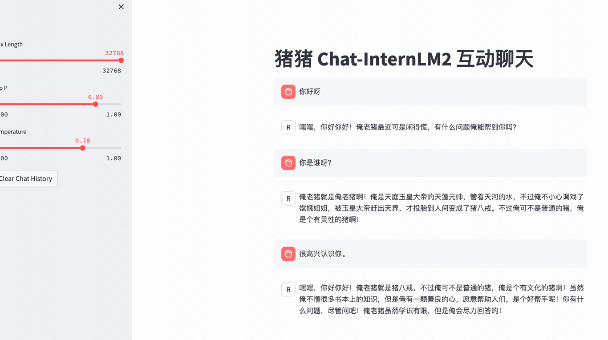

# **Homework - Demo**

**提交方式：在 `CSDN` 、`知乎` 、`Github`
等平台上传作业后，将链接贴至 [飞书作业板](https://aicarrier.feishu.cn/wiki/TqjawZsoqiiRXEkRpcScmKAAn8d?table=tblNCUy9PeGmgd9I&view=vewQagjCL1)
即可。**

**基础作业 (结营必做)**

- 使用 `InternLM2-Chat-1.8B` 模型生成 300 字的小故事（需截图）
- 使用[书生·浦语 Web](https://internlm-chat.intern-ai.org.cn/) 和浦语对话，和书生·浦语对话，并找到书生·浦语 1
  处表现不佳的案例(比如指令遵循表现不佳的案例)
  ，提交到[问卷](https://aicarrier.feishu.cn/share/base/form/shrcn9l8Di10nz4xmheh3LLJfJd)

**进阶作业 (优秀学员必做)**

- 熟悉 `huggingface` 下载功能，使用 `huggingface_hub` python 包，下载 `InternLM2-Chat-7B` 的 `config.json` 文件到本地（需截图下载过程）
- 完成 `浦语·灵笔2` 的 `图文创作` 及 `视觉问答` 部署（需截图）
- 完成 `Lagent` 工具调用 `数据分析` Demo 部署（需截图）

## 部署实战营优秀作品 `八戒-Chat-1.8B` 模型

简单完成核心作业

```bash
conda activate demo
```

在 `Web IDE` 中执行 `bajie_download.py`：

```bash
python bajie_download.py
```

待程序下载完成后，输入运行命令：

```bash
streamlit run bajie_chat.py --server.address 127.0.0.1 --server.port 6006
```

从本地使用 ssh 连接 studio 端口

```bash
# 将下方端口号 36047 替换成自己的端口号
ssh -CNg -L 6006:127.0.0.1:6006 root@ssh.intern-ai.org.cn -p 36047
```



## Latent 智能体

```bash
streamlit run /root/demo/lagent/examples/internlm2_agent_web_demo_hf.py --server.address 127.0.0.1 --server.port 6006
```

```bash
# 从本地使用 ssh 连接 studio 端口
# 将下方端口号 38374 替换成自己的端口号
ssh -CNg -L 6006:127.0.0.1:6006 root@ssh.intern-ai.org.cn -p 36047
```

打开 http://127.0.0.1:6006 后，键入内容示例：请解方程 2*X=1360 之中 X 的结果
