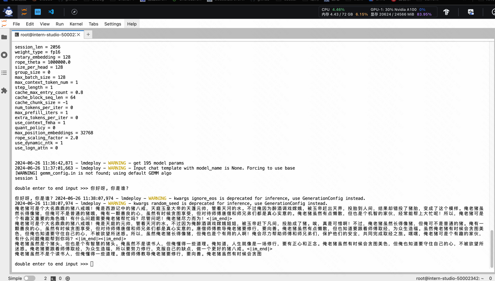

# 简单对话实践：与八戒-Chat-1.8B模型交互

## 安装并且启动环境

`pip install lmdeploy modelscope`

```bash
conda activate lmdeploy
```

## 下载模型

```python
import os
# 模型下载
from modelscope.hub.snapshot_download import snapshot_download

# 创建保存模型目录
os.system("mkdir -p /root/models")

# save_dir是模型保存到本地的目录
save_dir = "/root/models"

snapshot_download('JimmyMa99/BaJie-Chat-mini', cache_dir=save_dir)
```

## 和模型对话

```bash
lmdeploy chat /root/models/JimmyMa99/BaJie-Chat-mini 
```

