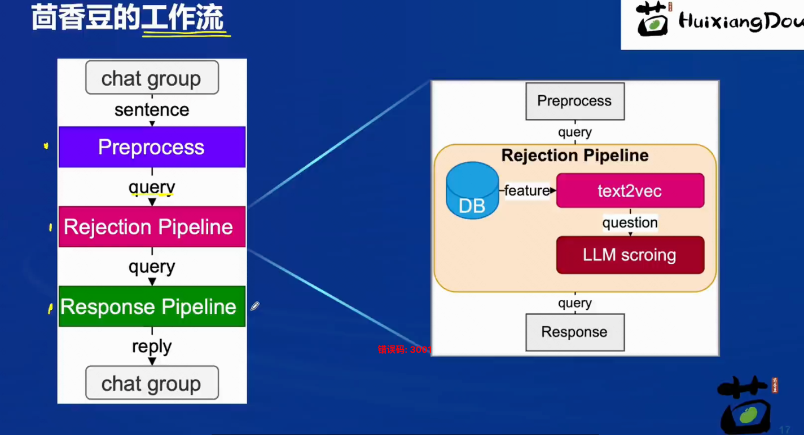

# 第三课作业

## 基础作业 - 任意选一个作业

### 1. 在[茴香豆 Web 版](https://openxlab.org.cn/apps/detail/tpoisonooo/huixiangdou-web)中创建自己领域的知识问答助手

- 参考视频[零编程玩转大模型，学习茴香豆部署群聊助手](https://www.bilibili.com/video/BV1S2421N7mn)
- 完成不少于 400 字的笔记 + 线上茴香豆助手对话截图(不少于5轮)
- （可选）参考 [代码](https://github.com/InternLM/HuixiangDou/tree/main/web) 在自己的服务器部署茴香豆 Web 版

### 2.在 `InternLM Studio` 上部署茴香豆技术助手

- 根据教程文档搭建 `茴香豆技术助手`，针对问题"茴香豆怎么部署到微信群？"进行提问
- 完成不少于 400 字的笔记 + 截图

## 进阶作业 （作业难度非常难, 不用纠结，请先学完后续的课程内容再来做此处的进阶作业～）

### A.【应用方向】 结合自己擅长的领域知识（游戏、法律、电子等）、专业背景，搭建个人工作助手或者垂直领域问答助手，参考茴香豆官方文档，部署到下列任一平台。

- 飞书、微信
- 可以使用 茴香豆 Web 版 或 InternLM Studio 云端服务器部署
- 涵盖部署全过程的作业报告和个人助手问答截图

### B.【算法方向】尝试修改 `good_questions.json`、调试 prompt 或应用其他 NLP 技术，如其他 chunk 方法，提高个人工作助手的表现。

- 完成不少于 400 字的笔记 ，记录自己的尝试和调试思路，涵盖全过程和改进效果截图

## 大作业项目选题

### A.【工程方向】 参与贡献茴香豆前端，将茴香豆助手部署到下列平台

- Github issue、Discord、钉钉、X

### B.【应用方向】 茴香豆RAG-Agent

- 应用茴香豆建立一个 ROS2 的机器人Agent

### C.【算法方向】 茴香豆多模态

- 参与茴香豆多模态的工作

## 部署茴香豆助手

### Basic 服务端部署

* 准备环境&下载并安装茴香豆
* 修改配置文件， 主要需要指定以下三个模型：
    * 用于向量数据库和词嵌入的模型
    * 用于检索的重排序模型
    * 用于回答问题的生成模型
* 创建知识库
    * 语料知识的向量数据库
    * 接受和拒答两个向量数据库
* 启动茴香豆服务



```bash
conda activate InternLM2_Huixiangdou

```

复制茴香豆所需模型文件到服务器上的`models`文件夹下

```bash
# 创建模型文件夹
cd /root && mkdir models

# 复制BCE模型
ln -s /root/share/new_models/maidalun1020/bce-embedding-base_v1 /root/models/bce-embedding-base_v1
ln -s /root/share/new_models/maidalun1020/bce-reranker-base_v1 /root/models/bce-reranker-base_v1

# 复制大模型参数（下面的模型，根据作业进度和任务进行**选择一个**就行）
ln -s /root/share/new_models/Shanghai_AI_Laboratory/internlm2-chat-7b /root/models/internlm2-chat-7b

```

用已下载模型的路径替换 `/root/huixiangdou/config.ini` 文件中的默认模型，需要修改 3 处模型地址，分别是:

命令行输入下面的命令，修改用于向量数据库和词嵌入的模型

```bash
sed -i '6s#.*#embedding_model_path = "/root/models/bce-embedding-base_v1"#' /root/huixiangdou/config.ini

```

用于检索的重排序模型

```bash
sed -i '7s#.*#reranker_model_path = "/root/models/bce-reranker-base_v1"#' /root/huixiangdou/config.ini
```

和本次选用的大模型

```bash
sed -i '29s#.*#local_llm_path = "/root/models/internlm2-chat-7b"#' /root/huixiangdou/config.ini
```

创建知识库

```bash
cd /root/huixiangdou && mkdir repodir
git clone https://github.com/internlm/huixiangdou --depth=1 repodir/huixiangdou
```

提取知识库特征，创建向量数据库。除了语料知识的向量数据库，茴香豆建立接受和拒答两个向量数据库，用来在检索的过程中更加精确的判断提问的相关性，这两个数据库的来源分别是：

- 接受问题列表，希望茴香豆助手回答的示例问题
    - 存储在 `huixiangdou/resource/good_questions.json` 中
- 拒绝问题列表，希望茴香豆助手拒答的示例问题
    - 存储在 `huixiangdou/resource/bad_questions.json` 中
    - 其中多为技术无关的主题或闲聊
        - 如："nihui 是谁", "具体在哪些位置进行修改？", "你是谁？", "1+1"

```bash
# 运行茴香豆
cd /root/huixiangdou/
python3 -m huixiangdou.main --standalone
```

### 使用远程模型

茴香豆除了可以使用本地大模型，还可以轻松的调用云端模型 API。 目前，茴香豆已经支持 `Kimi`，`GPT-4`，`Deepseek` 和 `GLM`
等常见大模型API。 想要使用远端大模型，首先修改 `/huixiangdou/config.ini` 文件中

```
enable_local = 0 # 关闭本地模型
enable_remote = 1 # 启用云端模型
```

接着修改 `remote_` 相关配置，填写 API key、模型类型等参数。

### 利用 Gradio 搭建网页 Demo

1. 首先，安装 **Gradio** 依赖组件：

```bash
pip install gradio==4.25.0 redis==5.0.3 flask==3.0.2 lark_oapi==1.2.4
```

2. 运行脚本，启动茴香豆对话 Demo 服务：

```bash
cd /root/huixiangdou
python3 -m tests.test_query_gradio 
```

此时服务器端接口已开启。如果在本地服务器使用，直接在浏览器中输入 [127.0.0.1:7860](http://127.0.0.1:7860/) ，即可进入茴香豆对话
Demo 界面。针对远程服务器，如我们的 `Intern Studio` 开发机，我们需要设置端口映射，转发端口到本地浏览器：

```
ssh -CNg -L 7860:127.0.0.1:7860 root@ssh.intern-ai.org.cn -p <你的端口号>
```