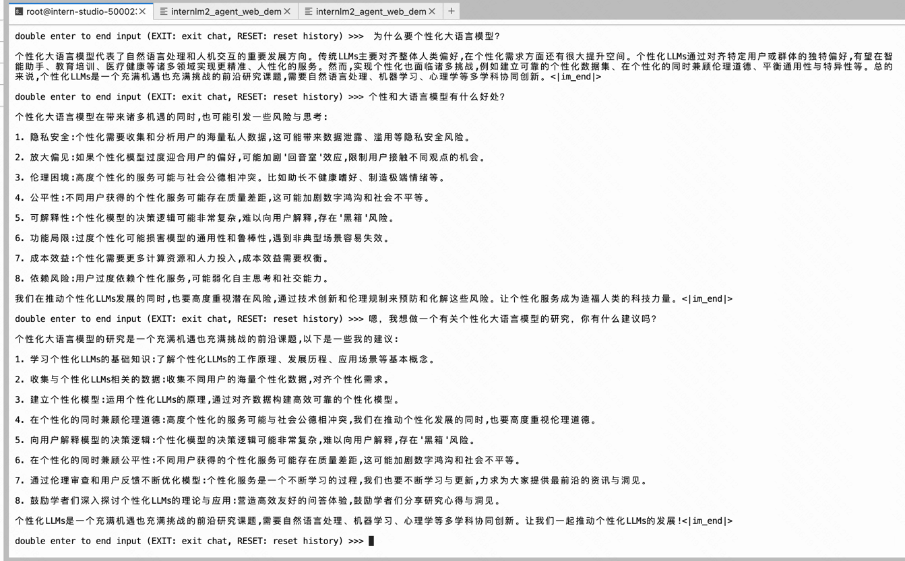

# 第 4 节课作业

记录复现过程并截图

## 基础作业（结营必做）

- 训练自己的小助手认知（记录复现过程并截图）

## 进阶作业

- 将自我认知的模型上传到 OpenXLab，并将应用部署到 OpenXLab（优秀学员必做）
- 复现多模态微调（优秀学员必做）

OpenXLab 部署教程：https://github.com/InternLM/Tutorial/tree/camp2/tools/openxlab-deploy

## 训练自己的小助手认知

三阶段微调过程如下：

1. **增量预训练阶段**：
    - 在海量领域文献数据上二次预训练GPT模型，以注入领域知识。这个阶段的主要目标是通过增加与特定任务相关的数据量来提升模型的性能和知识覆盖。

2. **有监督微调阶段**：
    - 构造指令微调数据集，在预训练模型基础上做精调，以对齐指令意图。这个阶段通过有监督学习的方式，使模型更好地理解和执行特定任务指令。

3. **强化学习或直接偏好优化阶段**：
    - 基于人类反馈对语言模型进行强化学习或直接偏好优化，以便生成高质量、更符合人类偏好的文本。这一阶段的目标是通过人类反馈优化模型的生成效果，使其更符合用户的预期和需求。

三阶段微调过程是为了提升模型在特定任务上的性能和准确性，通过逐步引入领域知识、对齐指令意图以及优化生成效果来实现这一目标。我们目前主要关注第2个阶段的有监督微调，
即构造指令微调数据集，对预训练模型进行精调，以对齐指令意图。

```bash
# 在ft这个文件夹里再创建一个存放数据的data文件夹
cd /root/ft/data
conda activate xtuner0.1.17
```

使用脚本 `prepare_data.py` 准备数据集，将数据集放在 `data` 文件夹下. 接下来是模型准备:

```bash
# 创建符号链接
ln -s /root/share/new_models/Shanghai_AI_Laboratory/internlm2-chat-1_8b /root/ft/model
```

在选择了一个最匹配的配置文件并准备好其他内容后，下面我们要做的事情就是根据我们自己的内容对该配置文件进行调整，使其能够满足我们实际训练的要求。

```bash
# 假如我们想找到 internlm2-1.8b 模型里支持的配置文件
xtuner list-cfg -p internlm2_1_8b

# 创建一个存放 config 文件的文件夹
mkdir -p /root/ft/config

# 使用 XTuner 中的 copy-cfg 功能将 config 文件复制到指定的位置
xtuner copy-cfg internlm2_1_8b_qlora_alpaca_e3 /root/ft/config
```

假如我们真的打开配置文件后，我们可以看到整体的配置文件分为五部分：

1. **PART 1 Settings**：涵盖了模型基本设置，如预训练模型的选择、数据集信息和训练过程中的一些基本参数（如批大小、学习率等）。

2. **PART 2 Model & Tokenizer**：指定了用于训练的模型和分词器的具体类型及其配置，包括预训练模型的路径和是否启用特定功能（如可变长度注意力），这是模型训练的核心组成部分。

3. **PART 3 Dataset & Dataloader**：描述了数据处理的细节，包括如何加载数据集、预处理步骤、批处理大小等，确保了模型能够接收到正确格式和质量的数据。

4. **PART 4 Scheduler & Optimizer**：配置了优化过程中的关键参数，如学习率调度策略和优化器的选择，这些是影响模型训练效果和速度的重要因素。

5. **PART 5 Runtime**：定义了训练过程中的额外设置，如日志记录、模型保存策略和自定义钩子等，以支持训练流程的监控、调试和结果的保存。

一般来说我们需要更改的部分其实只包括前三部分，而且修改的主要原因是我们修改了配置文件中规定的模型、数据集。后两部分都是
XTuner 官方帮我们优化好的东西，一般而言只有在魔改的情况下才需要进行修改。

下面开始微调训练

```bash
# work-dir 指定保存路径
# xtuner train /root/ft/config/internlm2_1_8b_qlora_alpaca_e3_copy.py --work-dir /root/ft/train

# 使用 deepspeed 来加速训练
xtuner train /root/ft/config/internlm2_1_8b_qlora_alpaca_e3_copy.py --work-dir /root/ft/train_deepspeed --deepspeed deepspeed_zero2
```

模型转化为通用的 Huggingface 模型

```bash
xtuner convert pth_to_hf /root/ft/train/internlm2_1_8b_qlora_alpaca_e3_copy.py /root/ft/train_deepspeed/iter_1200.pth /root/ft/huggingface
```

> 可以简单理解：LoRA 模型文件 = Adapter

除此之外，我们其实还可以在转换的指令中添加几个额外的参数，包括以下两个：
| 参数名 | 解释 |
| ------------------- | ------------------------------------------------------ |
| --fp32 | 代表以fp32的精度开启，假如不输入则默认为fp16 |
| --max-shard-size {GB} | 代表每个权重文件最大的大小（默认为2GB） |

对于 LoRA 或者 QLoRA 微调出来的模型其实并不是一个完整的模型，而是一个额外的层（adapter）。那么训练完的这个层最终还是要与原模型进行组合才能被正常的使用。
在 XTuner 中也是提供了一键整合的指令，但是在使用前我们需要准备好三个地址，包括原模型的地址、训练好的 adapter 层的地址（转为
Huggingface 格式后保存的部分）以及最终保存的地址。

```bash
# 创建一个名为 final_model 的文件夹存储整合后的模型文件
mkdir -p /root/ft/final_model

# 解决一下线程冲突的 Bug 
export MKL_SERVICE_FORCE_INTEL=1

# 进行模型整合
# xtuner convert merge  ${NAME_OR_PATH_TO_LLM} ${NAME_OR_PATH_TO_ADAPTER} ${SAVE_PATH} 
xtuner convert merge /root/ft/model /root/ft/huggingface /root/ft/final_model
```


```Bash
# 与模型进行对话
xtuner chat /root/ft/final_model --prompt-template internlm2_chat
```


最终效果:

